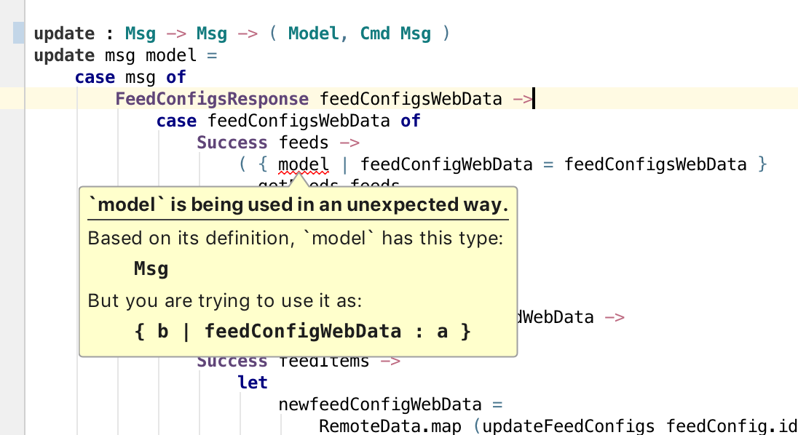
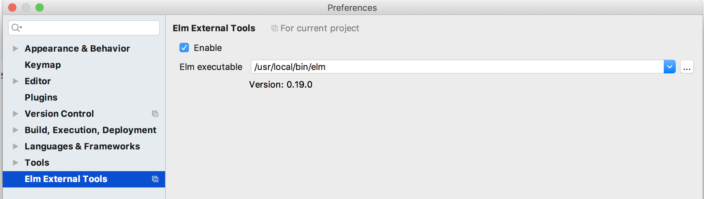

Provides external tools for the [Elm programming language](http://elm-lang.org)  in IntelliJ.

Requires the [Elm](https://plugins.jetbrains.com/plugin/10268-elm) plugin to be installed.

# External tools:

* External annotator using `elm make`

    Performs `elm make` on your Elm files and shows compile error messages inline.
    

    Configure external tool in Intellij Preferences
    
    
    
    